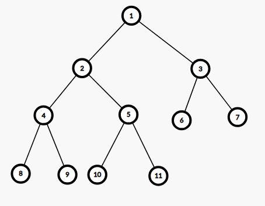
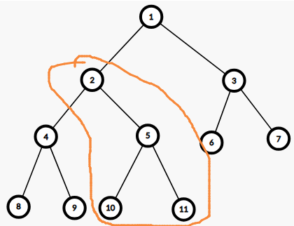

# 【题解】[ABC321E] Complete Binary Tree

## 题目链接

[E - Complete Binary Tree](https://www.luogu.com.cn/problem/AT_abc321_e)

## 题意概述

给定一棵 $n$ 个节点的树，对于每个 $i(2 \le i \le n)$，存在一条连接第 $i$ 个节点和第 $\left\lfloor\dfrac{i}{2}\right\rfloor$ 个节点的边，除此之外，没有其他边。

找到在这棵树中与节点 $x$ 的距离为 $k$ 的点有多少个。在这里，节点 $u$ 和 $v$ 之间的距离定义为树上从 $u$ 到 $v$ 的简单路径的边数。

本题多测，$T$ 组数据。

## 数据范围

- $1 \le T \le 10^5$
- $1 \le n \le 10^{18}$
- $1 \le x \le n$
- $0 \le k \le n-1$

## 题目分析

首先观察样例和阅读题意可以发现，题目中所给的树是一棵二叉树，且第 $i$ 个节点的儿子是 $2i$ 和 $2i+1$。

那么其实问题就转化为：如何快速地在这棵二叉树上找到与 $x$ 的距离为 $k$ 的点的个数。

我们很容易发现，与 $x$ 距离为 $k$ 的点，要么在 $x$ 为根的子树内，从 $x$ 往下走 $k$ 步；要么从 $x$ 往上走 $i(1 \le i \le k)$ 步到达一个点 $now$，然后从 $now$ 再往下向着不包含 $x$ 的一个子树走 $k-i$ 步。

考虑分类讨论：

首先考虑距离 $x$ 等于 $k$ 的点刚好在 $x$ 为根的子树内的情况，那么我们实际上要求出从 $x$ 出发往下走，走 $k$ 步最多能到达几个不同的点，这个问题有点抽象，我们画个图来理解一下。

在这张图中，节点 $2$ 往下走 $2$ 步可以到达 $8,9,10,11$ 这四个节点，节点 $5$ 往下走 $1$ 步可以到达 $10,11$ 这两个节点。

从这个例子我们可以看出，从这棵二叉树上的一个节点 $x$ 往下走 $k$ 步能够到达的节点是二叉树某一层的连续区间，即 $[x\times 2^k,=x\times 2^k + 2^k-1]=[x\times 2^k,(x+1)\times 2^k-1]$ 中的节点。

那么从 $x$ 往下走 $k$ 步能到达的点的个数就是 $r-l+1$，其中 $l=x\times 2^k,r=(x+1)\times 2^k -1$。

这里还有一个细节，当区间 $[l,r]$ 中有节点编号 $>n$ 时，编号大于 $n$ 的节点不能算在答案之内，所以我们最终的 $[l,r]$ 还要和 $[1,n]$ 取交集。

---

接下来我们考虑 $x$ 往上走 $i$ 步之后再往下走的情况。

由于 $n$ 最大是 $10^{18}$ 级别的，那么二叉树的深度最大是 $\log 10^{18}≈60$ 这个级别的，那么极端情况下我们往上走的步数 $i$ 最大也只能是这个级别，所以我们可以枚举 $i$，由于结构是树，所以对于 $x$，往上走 $i$ 之后到达的节点一定是唯一确定的，假设走到的节点是 $now$。

接下来，我们要从 $now$ 再往下向着不包含 $x$ 的一个子树走 $k-i$ 步。什么叫“往下向着不包含 $x$ 的子树走 $k-i$ 步”呢？我们举个例子来说明一下。

还是这张图，假如让 $x=5,k=4,i=2$，那么我们首先从 $5$ 向上走 $2$ 步到达 $1$，那么被圈住的部分就是 $now$ 的子树中包含 $x$ 的子树，然后再从 $1$ 往下走 $2$ 步，这个时候圈住的部分就不能再走，所以我们只能到达 $4,6,7$ 这三个节点，不能到达 $5$